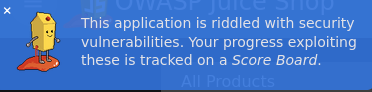
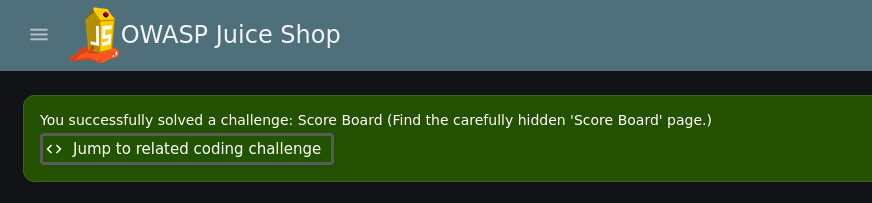

# Score Board

> **Educational purpose only.** This documentation describes a vulnerability in the OWASP Juice Shop, an intentionally vulnerable training application. It is provided for educational and defensive purposes and was reproduced on a local instance only.

**Category:** Miscellaneous (Security through Obscurity / Forced Browsing)
**OWASP mapping:** A01:2021 Broken Access Control (CWE-425 Direct Request)
**Difficulty:** 1 star
**Video:** _TODO: add Loom link (max 5 minutes)_

## Table of Contents

- [Overview](#overview)
- [Why it is dangerous](#why-it-is-dangerous)
- [Reproduction](#reproduction)
- [Root cause](#root-cause)
- [Mitigation](#mitigation)
- [References](#references)

## Overview

The Juice Shop contains a Score Board page that lists every challenge in the application and tracks which ones have been solved. The page is not linked anywhere in the navigation, so it is only "hidden" by not being advertised. Anyone who knows or guesses the route can open it directly in the browser, because nothing but obscurity protects it.

## Why it is dangerous

Hiding a page instead of protecting it is a common pattern in real applications: admin panels, debug consoles, internal dashboards, staging features or backup files that are "not linked, so nobody will find them". Attackers do not rely on links. They read the client side JavaScript, guess common names and run wordlist based tools that try thousands of paths in minutes.

Concrete dangers:

- **Information disclosure:** in the Juice Shop the Score Board reveals the full list of vulnerabilities in the application. In a real system an equivalent page would hand an attacker a roadmap of weak spots.
- **Access to privileged functions:** if the hidden page is an admin or debug interface, finding it can lead directly to data manipulation, user management or configuration changes.
- **Entry point for further attacks:** hidden pages are often less tested and less hardened, so they frequently contain additional flaws.

Wider consequences for users and operators:

- Leakage of personal or business data, with legal consequences such as GDPR fines and mandatory breach notifications.
- Loss of customer trust and reputational damage.
- A false sense of security inside the team, because a feature that "nobody can find" is never treated as an attack surface.

## Reproduction

**Preconditions:** a local Juice Shop instance is running and reachable at `http://localhost:3000`. No account is required.

1. Start the Juice Shop and open the start page in the browser:

   ```text
   http://localhost:3000/#/
   ```

2. Get an overview of the application. The side menu and header do not contain a link to a Score Board.
3. Open the page source and search for the term `hidden`. Nothing useful shows up, because the Juice Shop is an Angular single page application and the HTML is only a small shell.
4. Click **Help getting started** in the welcome banner. The tutorial explains that progress is tracked on a *Score Board*, which confirms that such a page exists.

   

5. Search the page source for `score`. There is no match, since the client side routes are not part of the HTML.
6. Guess the route based on common URL naming conventions. Multi word routes in web applications are usually written in kebab-case, meaning lowercase words separated by hyphens.
7. Open the kebab-case version of "Score Board" directly in the address bar:

   ```text
   http://localhost:3000/#/score-board
   ```

   

**Result:** the Score Board opens and the Juice Shop shows the notification "You successfully solved a challenge: Score Board". The challenge is marked as solved.

**Alternative approach (more systematic):** instead of guessing, open the browser developer tools, go to the Debugger (Firefox) or Sources (Chromium) tab, open the main JavaScript bundle and search for `score`. The route definition `score-board` appears in the bundled code, which reveals the path directly.

## Root cause

The Score Board is a normal client side route in the Angular frontend. It is registered in the routing configuration (`frontend/src/app/app.routing.ts`) and shipped to every visitor as part of the JavaScript bundle. Only the menu entry is missing:

```ts
{
  path: 'score-board',
  component: ScoreBoardComponent
}
```

The underlying weakness is **security through obscurity**: the page is considered protected because it is not linked. There is no authorization check on the route itself and no restriction on the backend API that delivers the challenge data to the page. Any code that is sent to the browser, including every route name, must be treated as public.

In the Juice Shop this is intentional, because the Score Board is the starting point for all other challenges. The pattern itself is what matters for real applications.

## Mitigation

Treat every route and endpoint as publicly known and protect sensitive functionality with real, server side access control:

1. **Enforce authorization on the server.** Every API endpoint behind a sensitive page must check authentication and role before returning data. Hiding the page in the UI is not a control.
2. **Use client side guards only for user experience.** An Angular route guard can hide a page from users without the right role, but it can be bypassed in the browser, so it must always be backed by the server check.
3. **Do not ship what the user must not see.** Keep admin or internal tools in a separate application or deployment, or lazy load them only after a successful server side role check.
4. **Remove debug and test features from production builds** and regularly scan your own application with content discovery tools to find forgotten paths before attackers do.

Secure example on the backend (Express), where the data behind a restricted page is only returned to admins:

```js
// Allow the request only if the verified user has the required role
function requireRole(role) {
  return (req, res, next) => {
    if (!req.user || req.user.role !== role) {
      return res.status(403).json({ error: 'Forbidden' });
    }
    next();
  };
}

// authenticate verifies the session or JWT and sets req.user
app.get('/api/internal/report', authenticate, requireRole('admin'), reportHandler);
```

Matching frontend route, where the guard only improves the user experience and the real protection stays on the server:

```ts
{
  path: 'internal-report',
  component: InternalReportComponent,
  canActivate: [AdminGuard]
}
```

**Key takeaways:**

- Obscurity is not access control. Anything in the frontend bundle is visible to everyone.
- Protect sensitive data and functions with server side authentication and authorization checks.
- Client side guards are convenience, not security.

## References

- OWASP Juice Shop project: https://owasp.org/www-project-juice-shop/
- Pwning OWASP Juice Shop (official companion guide): https://pwning.owasp-juice.shop/
- OWASP Top 10 2021, A01 Broken Access Control: https://owasp.org/Top10/A01_2021-Broken_Access_Control/
- CWE-425 Direct Request (Forced Browsing): https://cwe.mitre.org/data/definitions/425.html
- OWASP Web Security Testing Guide, Review Web Page Content for Information Leakage: https://owasp.org/www-project-web-security-testing-guide/latest/4-Web_Application_Security_Testing/01-Information_Gathering/05-Review_Web_Page_Content_for_Information_Leakage