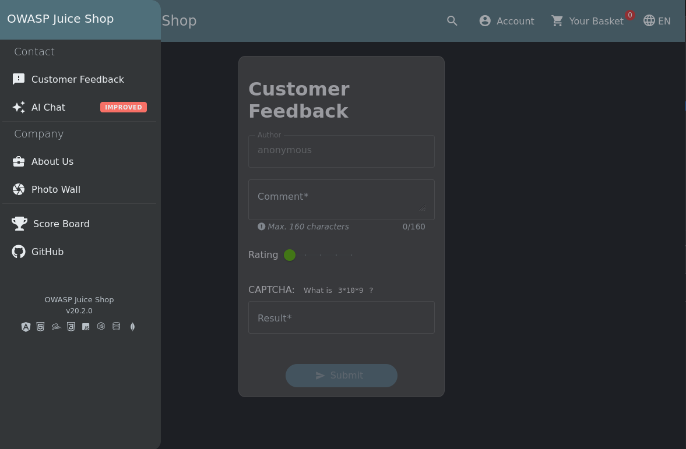
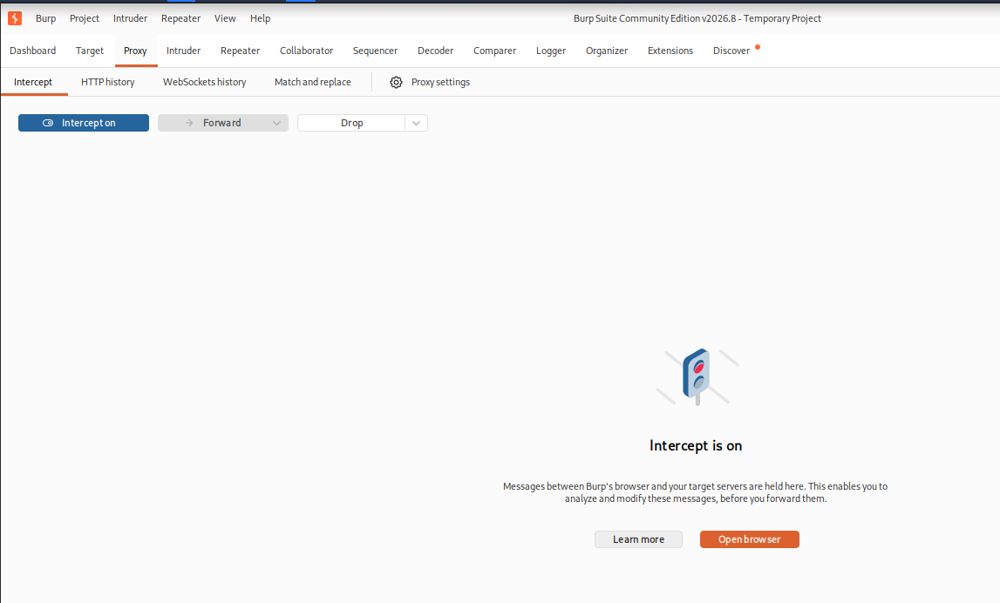
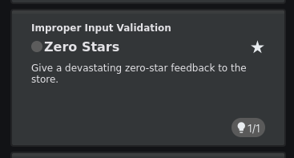

# Zero Stars

> **Educational purpose only.** This documentation describes a vulnerability in the OWASP Juice Shop, an intentionally vulnerable training application. It is provided for educational and defensive purposes and was reproduced on a local instance only.

**Category:** Improper Input Validation
**OWASP mapping:** CWE-20 Improper Input Validation (relates to A04:2021 Insecure Design)
**Difficulty:** 1 star

## Table of Contents

- [Overview](#overview)
- [Why it is dangerous](#why-it-is-dangerous)
- [Reproduction](#reproduction)
- [Root cause](#root-cause)
- [Mitigation](#mitigation)
- [References](#references)

## Overview

The Customer Feedback form lets a user rate the shop from one to five stars. The star control in the browser never allows a rating of zero, so a zero rating looks impossible through the normal interface. The server, however, stores whatever rating value the request contains. By editing the submitted request so that the rating is `0`, the feedback is saved with zero stars and the challenge is solved.

## Why it is dangerous

On its own a zero star rating is harmless, but it is a clear sign of a deeper problem: the backend trusts input coming from the browser instead of checking it. The same weakness lets a client send any value the server did not expect.

- A rating outside the intended range (for example `0`, `-5`, or `9999`) can distort average ratings and any statistics built on them.
- A value of the wrong type or an oversized value can cause errors or break pages that assume the rating is always one to five.
- Once a team learns that one field is not validated on the server, the same pattern often applies to other fields, which widens the attack surface.

For the business this means that reports and displayed ratings can no longer be trusted, and that the application behaves in ways that were never designed or tested.

## Reproduction

**Preconditions:**

- Local Juice Shop instance running on `http://localhost:3000`
- An intercepting proxy (Burp Suite) configured as the browser proxy
- Burp Proxy set to **Intercept is on**

1. In the side navigation, open **Customer Feedback**.

   

2. Enter a comment and solve the CAPTCHA, but do not submit yet.

3. In Burp, confirm that interception is active so the submit request is held for editing.

   

4. Submit the feedback. Burp holds the `POST` request to the feedback endpoint. The request body is JSON and contains a `rating` field with the value selected in the browser.

5. Change the `rating` value in the JSON body to `0`, then click **Forward** to send the modified request to the server.

**Result:** The server accepts the request and saves the feedback with a rating of zero, even though the interface never allows it. The challenge appears as solved on the Score Board.



## Root cause

The rating is only limited on the client side. The star control in the browser prevents a zero rating, but that check disappears the moment the request leaves the browser. The feedback endpoint takes the `rating` value from the request body and stores it without checking that it is a whole number within the allowed range of one to five. Because the server treats client input as already valid, any value that reaches it is saved as is.

## Mitigation

Validate every value on the server, independent of what the interface allows. The browser check is only there for convenience and can always be bypassed with a proxy. The server must reject a rating that is not a whole number between one and five before it is stored.

```js
// Reject any rating that is not a whole number from 1 to 5
function isValidRating(value) {
  return Number.isInteger(value) && value >= 1 && value <= 5;
}

// In the feedback route, before saving:
if (!isValidRating(req.body.rating)) {
  return res.status(400).json({ error: 'Rating must be a whole number from 1 to 5.' });
}
```

**Key takeaways:**

- Never trust input from the client. Treat UI limits as help for the user, not as security.
- Enforce type and allowed range on the server for every field before it is stored.

## References

- OWASP Juice Shop project: https://owasp.org/www-project-juice-shop/
- CWE-20 Improper Input Validation: https://cwe.mitre.org/data/definitions/20.html
- OWASP Input Validation Cheat Sheet: https://cheatsheetseries.owasp.org/cheatsheets/Input_Validation_Cheat_Sheet.html